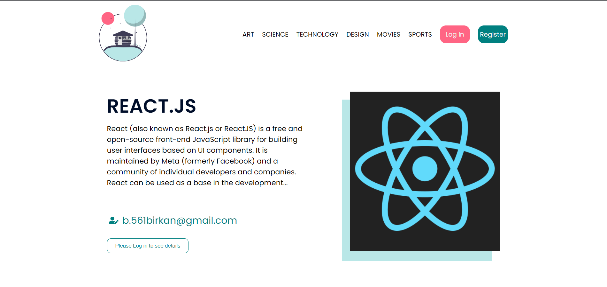

# Blog App 🖊

## Table of contents

- [Summary](#summary)
- [Screenshot](#screenshot)
- [Link](#links)
- [Built with](#built-with)
- [Utility Links](#utility-links)

##

> In this project, I have worked with HTML, CSS, JavaScript, React.js and Firebase to create this good-looking fully-responsive page 🎯.  
> I've used the advantages of React.js to manipulate the DOM efficiently 🎢.  
> I like working with Firebase to handle database tables for making CRUD operations, it was easy to manage 🤝.  
> Also love to use firebase-auth for authentication process. I am thankful to Firebase for providing us the social media auth, I really enjoy to use Google and Github auth in my project 🛡.  
> In CSS process, I've used pure-css and this made my css-skills powerful 🌌.  
> In creating and updating post section, I had a chance to work with **react-quill** package and it was really life-saver for editing text blocks 🤖.

## Links

<a href="https://blogonfire.vercel.app/">Live Version of the project</a>

## Screenshot

## Built with

- HTML
- CSS
- JavaScript
- React.js

## Utility Links

> [JavaScript](https://developer.mozilla.org/en-US/docs/Web/JavaScript)  
> [React.js](https://beta.reactjs.org/)  
> [React Quill](https://github.com/zenoamaro/react-quill)  
> [Using dangerouslySetInnerHTML in a React application](https://blog.logrocket.com/using-dangerouslysetinnerhtml-in-a-react-application/)

 Keep Building 🚀

